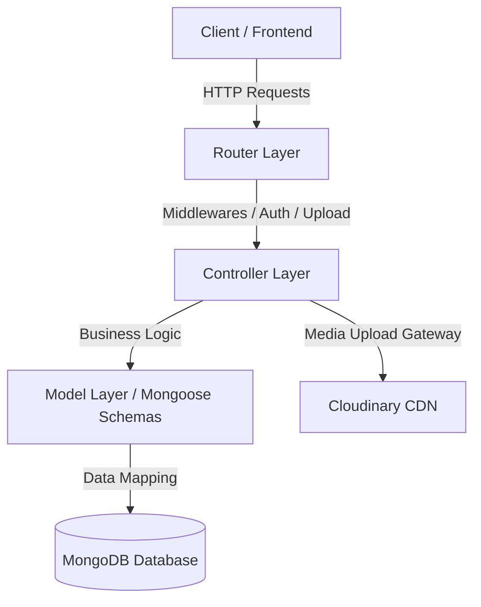
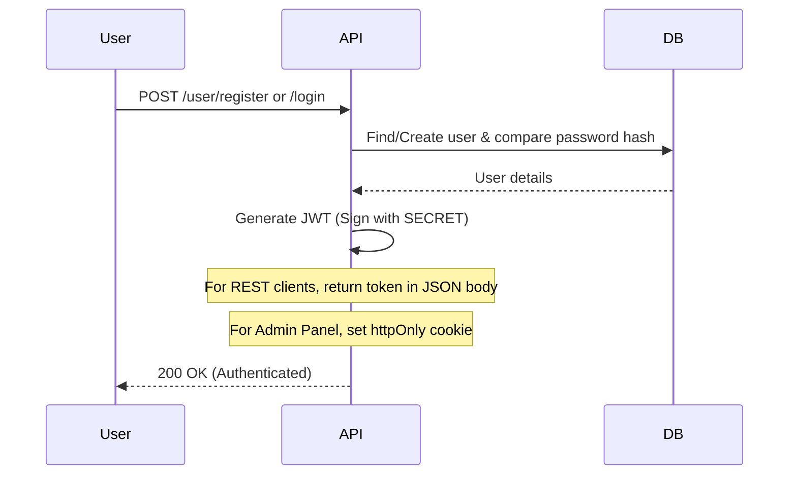
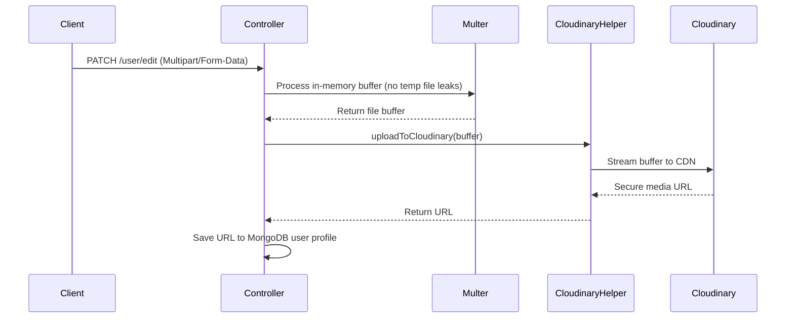

# 🏛️ PetAdopt Backend System Architecture

This document describes the software architecture, design patterns, and core workflows of the **PetAdopt API**. It serves as a guide for developers and recruiters to understand how the system is structured and why certain architectural decisions were made.

---

## 🧭 Design Patterns & Separation of Concerns

The backend follows the **MVC (Model-View-Controller)** pattern adapted for RESTful services, keeping a clean separation of concerns:



### 1. Router Layer (`routes/`)
Defines the REST endpoints, associates them with the appropriate controller methods, and applies route-specific middlewares (such as token validation or file upload filters).

### 2. Controller Layer (`controllers/`)
Contains the application's core business logic. Controllers receive requests, validate payloads, invoke models or helpers, and format JSON/HTML responses.

### 3. Model Layer (`model/`)
Defines the schema structures, data types, indexes, and validation rules using the Mongoose ODM, mapping JS objects to MongoDB documents.

### 4. Helper & Gateway Layer (`helpers/`)
Houses cross-cutting concerns, utility functions, and gateways for third-party integrations (e.g., Cloudinary API configuration).

---

## 🏗️ Folder Structure

```
petadopt-backend/
├── .github/workflows/   # CI/CD pipelines (GitHub Actions)
├── controllers/         # Business logic layer
├── db/                  # Database connection configuration
├── helpers/             # Security, utilities, and Cloudinary gateway
├── model/               # Mongoose database models
├── routes/              # Express endpoint routing
├── tests/               # Automated integration tests (Jest + Supertest)
├── views/               # EJS templates for the admin dashboard
├── index.js             # Entry point (server setup & middleware registration)
├── swagger.js           # Swagger autodoc generation script
└── swagger_output.json  # Compiled OpenAPI specifications
```

---

## 🔐 Core Workflows

### 1. Authentication & Session Management
The platform uses **JSON Web Tokens (JWT)** for stateless API authorization and **Secure HTTP-Only Cookies** for the Server-Side Rendered (SSR) admin dashboard:



### 2. Media Upload & Gateway Pattern (Decoupling)
Third-party integrations (Cloudinary) are abstracted behind a gateway helper to ensure that core business logic is not tightly coupled to external SDKs:



---

## 🛡️ Production & Security Hardening
* **Zero Disk Storage**: Files uploaded via Multer use `multer.memoryStorage()`. This prevents server disk exhaustion and avoids creating temporary file residues.
* **HTTP-Only Cookies**: Cookies for the admin panel have `httpOnly: true` (preventing XSS access) and `sameSite: 'lax'` (mitigating CSRF attacks).
* **Reverse Proxy Trust**: Express is configured with `app.set('trust proxy', true)` so headers injected by reverse proxies (like Cloudflare, Render, or AWS ALBs) are trusted for HTTPS protocol detection.
* **API Security Headers**: The `helmet` middleware is used to inject standard secure HTTP headers.
